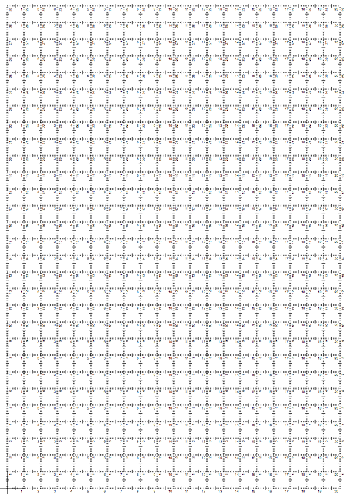

# cm grid
## A printable, two-dimensional ruler grid for measuring things

This is a pair of PDFs (one US Letter size, one A4) that you can print out in order to measure the width and height of anything smaller than a page.

**Make sure you print the PDF at *exactly* 100% scale.** Don't use “Scale to Fit Page” or anything similar. Otherwise, your centimeters will not be true centimeters.

### Example

Here's what the A4-sized ruler grid looks like:

### Open source

The PostScript (.ps) files are the source code. If you know PostScript, you can edit the grid-generating machinery or make your own paper sizes.

If you do edit the source, use make to regenerate the PDFs. You'll need to have pstopdf installed; theoretically, either Ghostscript's or Apple's should work, though I've only tried Apple's. If you add any other paper sizes, you will need to add them to the Makefile.

The license is a typical BSD license. See [LICENSE.txt](LICENSE.txt) for details.
